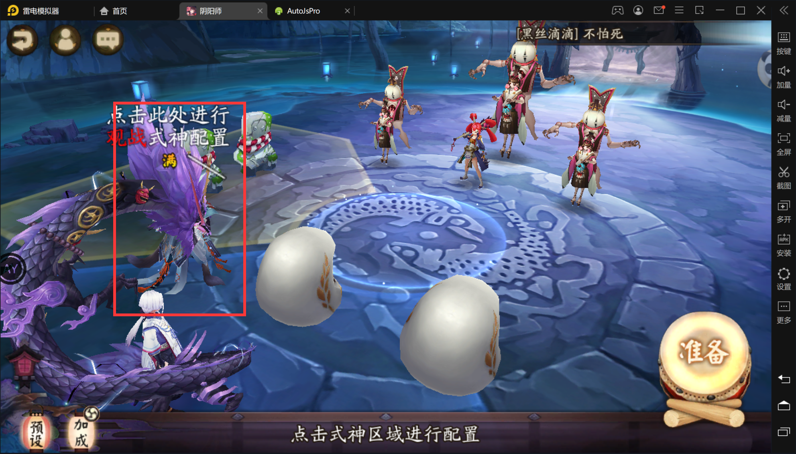

# 脚本操作相关
1. 脚本通过运行方案来执行任务，方案由多个启用的功能组成，功能后带星号的表示该功能有配置选项，功能的顺序会影响执行效果，排在前面的功能优先级更高，若在一个游戏的界面下有多个功能同时执行，将会执行排序在前面的功能，比如说个人探索方案中换狗粮和准备两个功能，换狗粮排在前面，若狗粮位置存在满级标识，会优先执行换狗粮而不是准备。
2. 方案可以收藏与取消收藏，收藏后的方案可以通过悬窗进行快速切换，在设置中也可开启切换方案后直接启动脚本。

# 分辨率问题
代码中已经做了多分辨率兼容，但是阴阳师在不同真机设备（尤其是异型屏）下表现差异过大，导致通用的多分辨率兼容无法支持，手机用户建议使用51虚拟机或VMOS的安卓7+的版本，修改，电脑用户使用雷电模拟器4(也是安卓7)，调整分辨率为 **720x1280** 或 **1280x720**，其它分辨率仅仅是在代码上做了兼容支持，并未进行充分测试，建议直接使用前面提到的分辨率进行使用。

# 模拟点击
安卓7以下使用Root进行模拟点击滑动相关操作，安卓7+使用无障碍进行点击和滑动操作，如果脚本设置中未开启无障碍权限请手动打开。

# 探索相关
换狗粮，队长与狗粮站位如下图。检测到狗粮区域有满级的标识后，换狗粮时使用素材列表的第1个和第2个，因此，需要将式神**折叠**关闭，将需要练的**素材**添加**喜欢**

